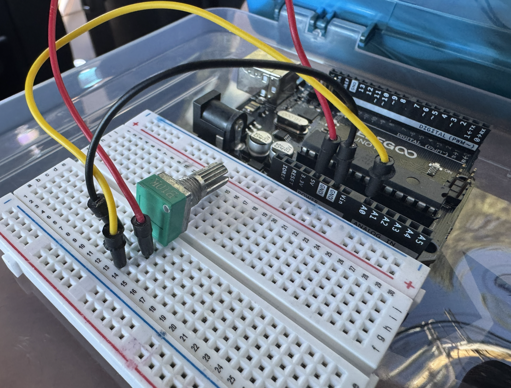
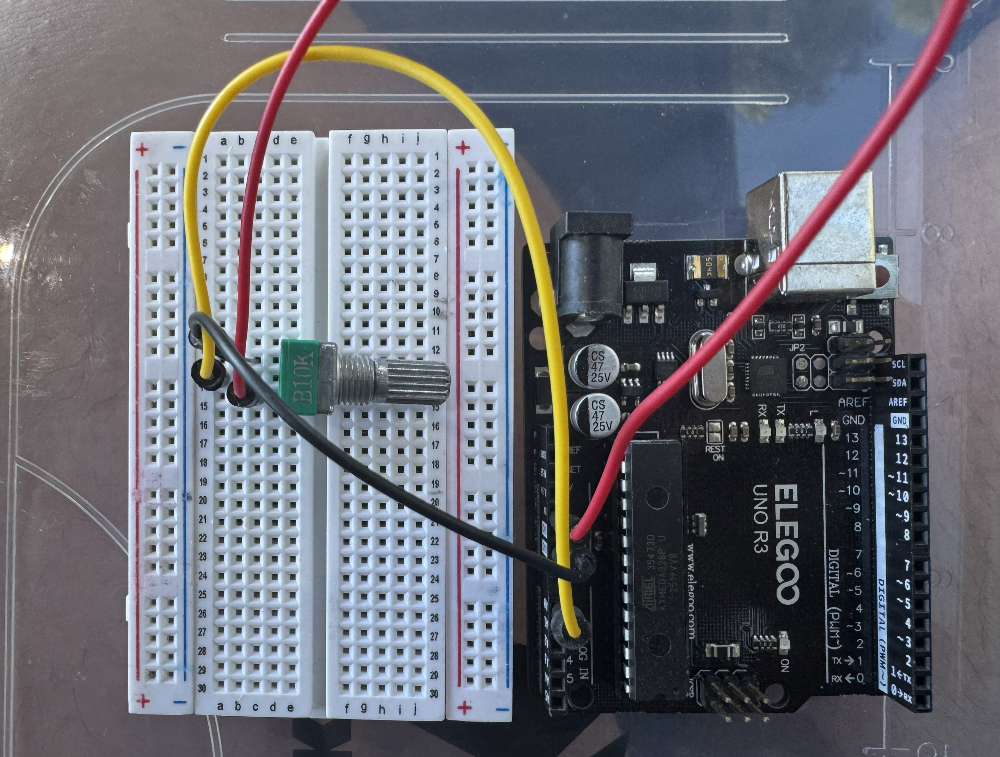

# Digital Erosion

_By Adam Hacker_

> Choas based on your own schedule! Then dimmed by your own twist. :)

---

## Showcase / Description of Finished Piece

"Digital Erosion" is an interactve art piece that combines both software and hardware into a single visual pulse. The "density" of your day (as determined by Google Calendar) and the turn of a knob control the chaos. The piece is meant to represent the delicate balance between what we control (the twist of the knob) and how much life controls us (the density of the calendar).

The artwork reads how many hours are marked busy om today's Google Calendar and then treats that as a baseline level of chaos. A busy day means that the artwork can never settle fully. On top of that, a potentiometer is wired through an Arduino and can act as a control level. But the knob alone is not enough. There's actually a hidden **sweet spot** that is randomized every time the sketch loads.

Once you twist the knob to the sweet spot, the artwalk "calms down". But even as it's calming, the sweet spots adjusts, forcing the user to constantly find balance in the chaos.

**Key features:**

- Calendar-driven chaos. It pulls today's busy hours from Google Calendar and sets it as a baseline level of visual turbulence the knob cannot fully escape
- A hidden potentiometer "sweet spot" that is randomized each run, so the calm position must be searched for rather than memorized
- Drifting calm — holding the knob in the sweet spot makes it slowly run away, keeping the search alive
- A p5.js pulse built from a noisy heartbeat ring and erratic spikes that intensify with chaos, shifting from teal-to-red turbulence to a warm yellow when calm
- A physical potentiometer read by an Arduino and streamed over Web Serial at 115200 baud
- Responsive full-window canvas that re-lays-out on any screen size

---

## Process

### Ideation / Design Process

Since the topic of this project was "Sense of Self", to start I looked inwards, trying to find what best represented me. At first, I thought about my favorite hobbies. But during this reflection, I somewhat sadly realized that most of my time is not _actually_ spent doing these tasks. So, could they really represent "me"? I quickly opened my phone to go to my calendar, to see where all my times goes.

In that moment, I realized that my online calendar itself is a representation of me. It's a reflection of how I choose to spend my time, filled with both strict academic commitments and fun social outings.

Moving forward, I knew that my project wanting to poke fun at this fun aspect of my life. I wanted to have my project based in the density of my calendar, and to showcase the little control we sometimes have over our lives.

### Prototyping / Building Process

The project is a small, self-contained web piece built with **p5.js** for rendering and the browser's **Web Serial API** (via the makeabilitylab `serial.js` helper) for talking to the hardware. The physical side is an **Arduino** with a single potentiometer on analog pin **A0**.

The visual is driven by a single `chaos` value between 0 and 1, assembled each frame from two sources:

- **The calendar** sets a floor. Today's busy hours are normalized against a configurable `maxBusyHours` to produce a `busyIntensity`. A fraction of that becomes `baseChaosFromBusy` — a minimum amount of turbulence that exists no matter where the knob sits.
- **The potentiometer** modulates the rest. The raw 0–1023 reading is normalized to 0–1, and its distance from the hidden `calmPotCenter` is measured. That distance is run through an eased falloff (`pow(1.0 - normalizedDistance, 1.4)`) to produce a `calmFactor`, which scales how much of the remaining "extra" chaos is suppressed.

On every run, `calmPotCenter` is set to a random value between 0.1 and 0.9. When the knob stays inside the calm zone for roughly 1.5 seconds (90 frames), `calmPotCenter` begins to drift — always away from the current knob position — so the viewer has to keep hunting for it. Step out of the zone and the hold timer resets.

That `chaos` value then drives nearly everything on screen: the heartbeat frequency and amplitude, the wobble of a Perlin-noise outer ring, the number and length of erratic spikes, and the stroke color. Near the sweet spot the piece deliberately overrides the palette to a warm, unmistakable yellow so the calm state reads clearly.

On the hardware side, the Arduino sketch is intentionally tiny: it reads `A0`, and only prints the value over serial when it changes, with a short `delay(15)` to keep the stream manageable. The p5 sketch parses each incoming line as an integer and stores it as the current pot value.

The piece also supports a **fake-data mode**. With `USE_FAKE_CALENDAR_DATA = true`, the sketch skips Google entirely and uses a `FAKE_BUSY_HOURS` constant, which makes it easy to develop, demo, or simulate a busier or calmer day without credentials.

The above two screenshots showcase the wiring required for the project.

https://github.com/user-attachments/assets/34f0cb41-e2ec-44ca-9adc-87c418bc4f2f

The above video showcases a live demo of the project. It is shown that the potentiometer can "calm" the choas of the visual piece.

<video src="https://github.com/user-attachments/assets/53193d49-8593-4e1a-abd0-f1b93f8d37ea" width="80%" controls></video>

The above video shows a video taken straight from the device, showcasing the calm / restful state of the artwork.

---

## Conclusion / Reflection

This project was a lot of fun. It was really nice connecting my artwork with an API, especially since that type of technology opens up so much possibility for future artwork.

It was definitely a bit challenging getting the API to work, and I'm not sure if it would be the easiest thing to recreate in the future. However, it was a good practice regardless.

I would want to improve this project in the future by showing a greater visual connection to the Google Calendar. Right now, the "busy hours" from the calendar are used as a baseline for the chaos, but it might be nice to show the actual events themselves. I'm not sure how this would work, but I think the piece could benefit from this stronger connection.
---

## Hardware Setup

You'll need:

- An Arduino (Uno or similar)
- One potentiometer (a 10kΩ linear pot works well)
- Jumper wires (and a breadboard, optionally)

Wiring:

- One outer pin of the potentiometer → **5V**
- The other outer pin → **GND**
- The middle pin (wiper) → analog pin **A0**

Upload [`serial_input/serial_input.ino`](serial_input/serial_input.ino) to the board before connecting. The sketch reads `A0` and streams the value over serial at **115200 baud**.

---

## Running the Project

The Web Serial API requires the page to be served over `http://localhost` (or HTTPS) — opening the HTML file directly will not work.

1. From the project folder, start a local server, e.g. `python3 -m http.server 8000`
2. Open **http://localhost:8000** in **Chrome or Edge** (Web Serial is not supported in Firefox or Safari).
3. Click **"Click me to connect to your Arduino!"** and select your board's serial port.
4. Turn the knob to hunt for the calm sweet spot — watch the pulse.

**Calendar data (optional).** By default the sketch runs in fake-data mode (`USE_FAKE_CALENDAR_DATA = true` in `art.js`), using `FAKE_BUSY_HOURS` so no Google account is needed. To drive the piece with your real calendar instead:

- In [Google Cloud Console](https://console.cloud.google.com/), create OAuth credentials and an API key, and enable the **Google Calendar API**.
- Add your local origin (e.g. `http://localhost:8000`) to the OAuth client's **Authorized JavaScript origins**.
- In `art.js`, set `USE_FAKE_CALENDAR_DATA = false` and replace `GCAL_API_KEY` and `GCAL_CLIENT_ID` with your own values.
- When you load the page, a Google sign-in popup will appear; sign in with the account whose calendar should drive the visual.

---

## Controls

- **Turn the potentiometer** — search for the hidden calm sweet spot; the pulse softens to a warm yellow as you near it, and the sweet spot drifts once you hold it
- **"Click me to connect to your Arduino!"** button — open the Web Serial connection to the board (once per session)

There is no other UI — the only inputs are the knob and your calendar.
